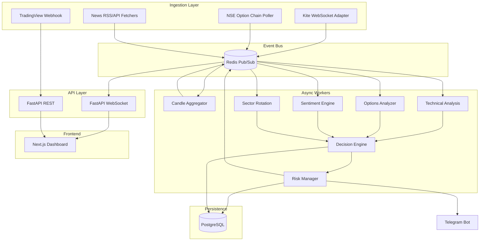

# Real-Time AI Intraday Trading Agent — Design Specification

**Date:** 2026-05-20  
**Status:** Draft for review  
**Scope:** Indian equities & index derivatives (NSE/BSE), market-hours intraday

---

## 1. Problem Statement

Build a production-grade, event-driven trading desk that behaves like a live professional trader: continuously ingesting tick/OI/news data, fusing multi-source signals, emitting probability-scored BUY/SELL/HOLD decisions with risk controls, and pushing sub-second updates to operators via dashboard and Telegram.

This is **not** a batch analytics or delayed-polling system. All market reactions must be driven by WebSocket/stream events.

---

## 2. Scope Decomposition

The full spec spans 8+ independent subsystems. They are delivered in **phases**, each producing runnable, testable software.

| Phase | Subsystem | Outcome |
|-------|-----------|---------|
| 0 | Platform foundation | Monorepo, Docker, Postgres, Redis, logging, config |
| 1 | Market data plane | Broker WebSocket → tick bus → OHLC aggregators |
| 2 | Analytics plane | Multi-TF indicators, breakout/reversal detectors |
| 3 | Options & sectors | OI/PCR/max-pain, sector rotation scores |
| 4 | Sentiment plane | News ingest + NLP classification + correlation |
| 5 | Decision engine | Signal fusion, confidence, risk gate |
| 6 | Experience plane | Next.js dashboard, WS broadcast, Telegram |
| 7 | External triggers | TradingView webhooks → pipeline |
| 8 | Learning & replay | Signal outcomes, backtest replay engine |

**Out of scope for v1 (YAGNI):** Auto order placement (paper/live execution), mobile native apps, Prophet forecasting, Sensibull scraping (legal/ToS risk — use broker/NSE APIs first).

---

## 3. Architecture Overview



### 3.1 Design Principles

- **Event-driven:** No polling for prices; scheduled jobs only for option chain (3–5s) and news (30–60s).
- **Adapter pattern:** `BrokerStreamAdapter` interface; v1 implements Zerodha Kite; Angel/Upstox as future adapters.
- **Clean architecture:** `domain` → `services` → `repositories` → `infrastructure`; FastAPI as composition root with DI.
- **Single writer per aggregate:** Candles and signals have one canonical writer per symbol/timeframe to avoid races.
- **Fail-safe:** Circuit breakers on broker/news APIs; degraded mode continues with last-known state + explicit `data_stale` flags on signals.

---

## 4. Technology Decisions

| Area | Choice | Rationale |
|------|--------|-----------|
| Broker (v1) | **Zerodha Kite Connect + WebSocket** | Largest Indian retail API docs; tick + depth |
| Backend | Python 3.12, FastAPI, asyncio | Ecosystem for TA/ML; async I/O |
| Message bus | Redis Pub/Sub + Streams (optional) | Low-latency fan-out; replay via Streams later |
| DB | PostgreSQL 16 + SQLAlchemy 2 async | ACID for signals/outcomes |
| Cache | Redis 7 | Hot quotes, sector scores, rate-limit tokens |
| Frontend | Next.js 14 App Router, Tailwind, TradingView widget | SSR + WS client |
| TA | TA-Lib + pandas | Standard indicators |
| NLP | `transformers` pipeline + optional OpenAI for summarization | Local model default; API for complex reasoning |
| Deploy | Docker Compose (dev), K8s manifests (prod-ready) | Matches requirement |

### 4.1 Assumptions (documented defaults)

- Operator has active **Kite Connect** subscription and API keys.
- **Paper trading mode** default; live orders require explicit `ENABLE_LIVE_TRADING=true`.
- Market hours: NSE 09:15–15:30 IST; workers idle outside with heartbeat only.
- Symbols v1: `NIFTY`, `BANKNIFTY`, `FINNIFTY` indices + configurable top-20 F&O stocks list in env.

---

## 5. Repository Layout

```
Trading-Agent/
├── docker-compose.yml
├── .env.example
├── README.md
├── backend/
│   ├── pyproject.toml
│   ├── alembic/
│   ├── app/
│   │   ├── main.py
│   │   ├── config.py
│   │   ├── di.py
│   │   ├── domain/           # entities, enums, signal DTOs
│   │   ├── services/         # business logic
│   │   ├── repositories/     # DB access
│   │   ├── infrastructure/   # kite, redis, telegram, http
│   │   ├── api/              # routes, websocket
│   │   └── workers/          # stream consumers
│   └── tests/
├── frontend/
│   ├── package.json
│   ├── src/app/
│   └── src/components/
├── deploy/
│   └── k8s/
└── docs/superpowers/
```

---

## 6. Domain Model

### 6.1 Signal (canonical JSON)

```json
{
  "id": "uuid",
  "signal": "BUY",
  "category": "INTRADAY",
  "symbol": "NIFTY",
  "instrument": "23600 CE",
  "entry": 218.0,
  "stop_loss": 205.0,
  "target_1": 235.0,
  "target_2": 248.0,
  "confidence": 84,
  "risk_level": "MEDIUM",
  "market_condition": "BULLISH",
  "holding_time": "15-30 mins",
  "reasons": ["..."],
  "data_stale": false,
  "created_at": "ISO8601"
}
```

### 6.2 Confidence Fusion (v1 heuristic, ML-ready)

Weighted score from normalized sub-scores (0–100):

| Source | Weight |
|--------|--------|
| Multi-TF trend alignment | 25% |
| Volume validation | 15% |
| Options (OI/PCR) | 20% |
| Sector alignment | 15% |
| Sentiment | 15% |
| TradingView webhook confirm | 10% |

Emit only if `confidence >= CONFIDENCE_THRESHOLD` (default 70) and risk engine approves.

### 6.3 Fake Breakout Detection

- Price breaks level but volume &lt; 1.5× 20-bar avg → penalize −20 confidence.
- OI shows opposite writing at strike → flag `trap_zone`.
- Higher TF (15m/30m) contradicts 1m breakout → downgrade to HOLD.

---

## 7. Database Schema (summary)

- `instruments` — symbol, token, type, expiry
- `ticks` — partitioned by day (optional retention 7d)
- `candles` — symbol, timeframe, OHLCV
- `option_chain_snapshots` — symbol, strike, CE/PE OI, IV, delta
- `news_items` — source, headline, sentiment, symbols
- `sector_scores` — sector, momentum, rank, ts
- `signals` — full signal JSON + status
- `signal_outcomes` — win/loss, pnl, exit_reason
- `confidence_history` — model version, features, score
- `risk_state` — daily PnL, consecutive losses, halted flag
- `webhook_events` — TradingView raw payload

Alembic migrations version all tables.

---

## 8. Real-Time Data Flow

1. **Kite ticker** connects at 08:55 IST, subscribes instrument tokens.
2. Each tick → `tick:{symbol}` Redis channel + optional persist batch.
3. **Aggregator worker** maintains rolling windows → publishes `candle:{symbol}:{tf}` on bar close.
4. **Analysis workers** subscribe to candle + OI channels → publish `analysis:{symbol}`.
5. **Decision engine** on any material change debounced 200ms → fuse → risk check → `signal:new`.
6. **WS gateway** fans `signal:new`, `market:update`, `sector:heatmap` to clients.
7. **Telegram** async send on `signal:new` where confidence ≥ alert threshold.

Reconnect: exponential backoff 1s–60s; resubscribe full token set; gap-fill via Kite REST historical for missed candles.

---

## 9. API Surface (v1)

| Method | Path | Purpose |
|--------|------|---------|
| GET | `/health` | Liveness |
| GET | `/api/v1/signals` | Active + recent signals |
| GET | `/api/v1/market/{symbol}` | Quote + last candle set |
| GET | `/api/v1/options/{symbol}` | Latest chain snapshot |
| GET | `/api/v1/sectors` | Sector heatmap |
| GET | `/api/v1/sentiment` | Aggregated sentiment |
| POST | `/api/v1/webhooks/tradingview` | HMAC-verified alerts |
| WS | `/ws/v1/stream` | Multiplexed live feed |

---

## 10. Frontend Dashboard (v1 screens)

1. **Command center** — index tiles, confidence meter, market bias
2. **Live chart** — TradingView widget + overlay markers from WS signals
3. **Option chain** — live OI heat table
4. **Signals feed** — cards with reasoning bullets
5. **Sector heatmap** — color by momentum
6. **News ticker** — sentiment chips
7. **Risk panel** — daily loss, halt status, active trades (manual entry for v1)

---

## 11. Risk Management

- `MAX_DAILY_LOSS_PCT`, `MAX_CONSECUTIVE_LOSSES`, `MIN_RR_RATIO` env vars.
- Volatility filter: ATR percentile &gt; 90 → block new SCALP.
- Sideways filter: ADX &lt; 20 on 15m → block INTRADAY entries.
- Position sizing: fixed fractional risk per signal (document formula in README).

---

## 12. Security & Compliance

- Secrets via env only; never commit `.env`.
- TradingView webhook: shared secret HMAC-SHA256 header.
- API: JWT for dashboard (optional v1 — can use API key behind VPN).
- **Disclaimer in README:** Not SEBI-registered advice; user responsible for trades.

---

## 13. Testing Strategy

- Unit: indicators, confidence fusion, risk rules, parsers
- Integration: Redis pub/sub round-trip, DB repositories (testcontainers)
- Contract: TradingView webhook payload fixtures
- Load: tick simulator → 1000 ticks/s soak test script

---

## 14. Approaches Considered

| Approach | Pros | Cons | Verdict |
|----------|------|------|---------|
| **A. Modular monolith + workers** | Simpler ops, shared domain | Scale limits at extreme HFT | **Recommended v1** |
| B. Microservices per engine | Independent scale | Ops complexity, latency | Phase 2+ extract hot paths |
| C. Kafka instead of Redis | Durability | Heavier infra | Defer; Redis Streams sufficient |

---

## 15. Success Criteria

- [ ] Subscribes to live Kite ticks during market hours with auto-reconnect
- [ ] Dashboard updates signal card &lt; 500ms after decision (local network)
- [ ] Option chain refresh ≤ 5s
- [ ] Emits structured signal JSON matching schema
- [ ] Risk engine blocks sub-threshold and halt conditions
- [ ] Backtest replays at least one strategy day from stored candles
- [ ] Docker Compose brings full stack up with sample data mode

---

## 16. Open Questions for Product Owner

1. **Broker:** Confirm Zerodha Kite as v1 (recommended) or prefer Angel/Upstox?
2. **Execution:** Paper-only v1 acceptable?
3. **LLM:** Local sentiment only vs OpenAI API for reasoning text?
4. **Symbol universe:** Fixed list or dynamic top-gainers scan?

*Defaults in this spec apply until overridden.*

---

*Next step after approval: implementation plan at `docs/superpowers/plans/2026-05-20-realtime-trading-agent.md`.*
